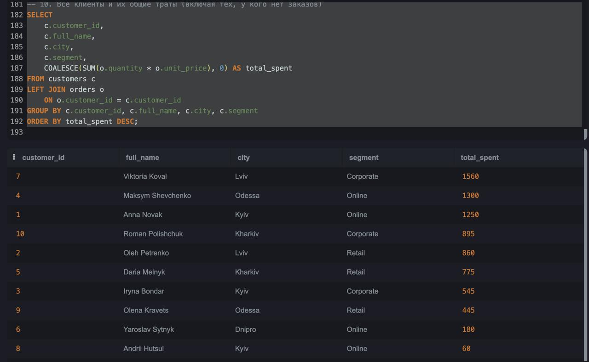
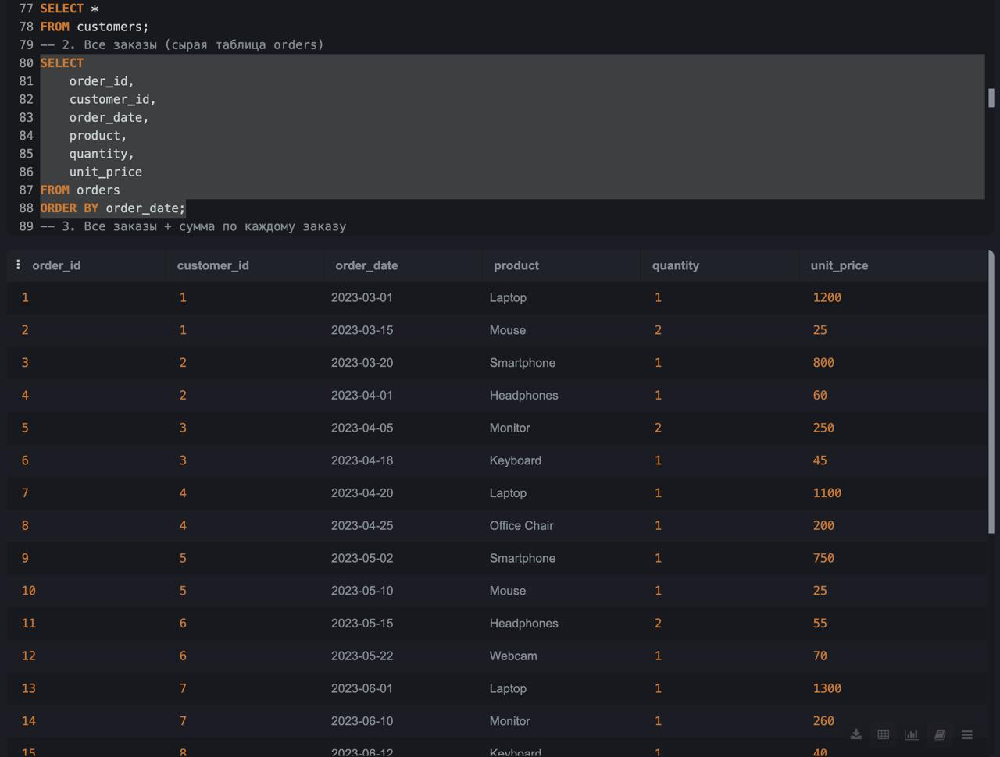
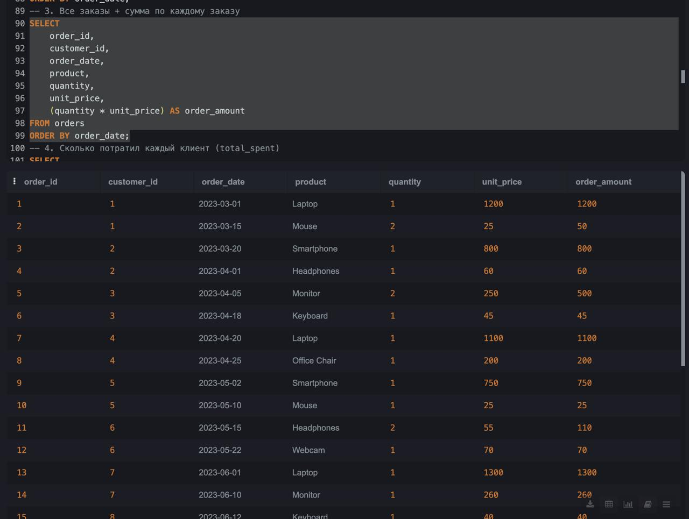

SQL Project: Customer Orders & Revenue Analysis
Author: Anastasiia Sakada
Database: SQLite
Tables: customers, orders, categories
Year: 2025

📌 Project Overview
This project simulates a small e-commerce database and demonstrates SQL skills used for data analysis:

Creating relational database tables

Inserting structured test data

Using JOIN, GROUP BY, HAVING, window functions

Calculating revenue, customer segments, and order metrics

Producing insights for business decision-making

📂 Database Structure
1. Customers table
Stores customer profiles and segment information.

2. Categories table
Maps each product to a product category (Electronics, Accessories, etc.).

3. Orders table
Contains order transactions, including quantity and unit price.

All tables are linked using a foreign key relationship:

orders.customer_id → customers.customer_id

🧱 SQL Schema (DDL)
-- 1. Drop existing tables (for clean re-run)
DROP TABLE IF EXISTS orders;
DROP TABLE IF EXISTS customers;
DROP TABLE IF EXISTS categories;

-- 2. Customers table
CREATE TABLE customers (
    customer_id INTEGER PRIMARY KEY,
    full_name   TEXT NOT NULL,
    city        TEXT,
    segment     TEXT,
    signup_date TEXT
);

-- 3. Categories table (maps product → category)
CREATE TABLE categories (
    category_id INTEGER PRIMARY KEY,
    product     TEXT NOT NULL,
    category    TEXT NOT NULL
);

-- 4. Orders table
CREATE TABLE orders (
    order_id    INTEGER PRIMARY KEY,
    customer_id INTEGER NOT NULL,
    order_date  TEXT NOT NULL,
    product     TEXT NOT NULL,
    quantity    INTEGER NOT NULL,
    unit_price  REAL NOT NULL,
    FOREIGN KEY (customer_id) REFERENCES customers(customer_id)
);

📥 Insert Test Data (DML)
-- Insert customers
INSERT INTO customers (customer_id, full_name, city, segment, signup_date) VALUES
(1,'Anna Novak','Kyiv','Online','2023-01-10'),
(2,'Oleh Petrenko','Lviv','Retail','2023-02-05'),
(3,'Iryna Bondar','Kyiv','Corporate','2023-02-20'),
(4,'Maksym Shevchenko','Odessa','Online','2023-03-01'),
(5,'Daria Melnyk','Kharkiv','Retail','2023-03-15'),
(6,'Yaroslav Sytnyk','Dnipro','Online','2023-04-01'),
(7,'Viktoria Koval','Lviv','Corporate','2023-04-10'),
(8,'Andrii Hutsul','Kyiv','Online','2023-05-01'),
(9,'Olena Kravets','Odessa','Retail','2023-05-20'),
(10,'Roman Polishchuk','Kharkiv','Corporate','2023-06-01');

-- Insert product categories
INSERT INTO categories (category_id, product, category) VALUES
(1,'Laptop','Electronics'),
(2,'Smartphone','Electronics'),
(3,'Headphones','Accessories'),
(4,'Keyboard','Accessories'),
(5,'Mouse','Accessories'),
(6,'Monitor','Electronics'),
(7,'Office Chair','Home Office'),
(8,'Webcam','Accessories');

-- Insert orders
INSERT INTO orders (order_id, customer_id, order_date, product, quantity, unit_price) VALUES
(1,1,'2023-03-01','Laptop',1,1200),
(2,1,'2023-03-15','Mouse',2,25),
(3,2,'2023-03-20','Smartphone',1,800),
...
(20,10,'2023-07-05','Webcam',1,75);

🔍 Analytical Queries (10 SQL tasks)
Here are example tasks performed in the project:

1. List all customers
sql
SELECT * FROM customers;
2. Raw order table
sql
SELECT order_id, customer_id, order_date, product, quantity, unit_price
FROM orders
ORDER BY order_date;
3. Order amount per order
sql
SELECT *,
       (quantity * unit_price) AS order_amount
FROM orders;
4. Total spending per customer
sql
SELECT 
    o.customer_id,
    c.full_name,
    SUM(o.quantity * o.unit_price) AS total_spent
FROM orders o
JOIN customers c ON c.customer_id = o.customer_id
GROUP BY o.customer_id
ORDER BY total_spent DESC;
5. Products with revenue above average
sql
SELECT product, SUM(quantity * unit_price) AS revenue
FROM orders
GROUP BY product
HAVING SUM(quantity * unit_price) >
       (SELECT AVG(qty_price) FROM 
            (SELECT SUM(quantity*unit_price) AS qty_price FROM orders GROUP BY product)
       );
…and more (queries 6–10)
JOINs, segmentation, filtering by date, etc.

📊 Screenshots
Include in your repository:

✔️ Screenshot of total spending per customer 

✔️ Screenshot of raw orders table  

✔️ Screenshot of orders with calculated order amount  

These help recruiters quickly understand your results.

🚀 How to Run This Project
Open SQLiteOnline, DBeaver, DataGrip, or any SQL editor.

Copy the entire SQL script from this repository.

Run the script from top to bottom:

tables creation

inserts

analytical queries

Review query output in your SQL editor.

📝 Insights & Conclusions
This dataset shows:

Top spenders (Viktoria Koval, Maksym Shevchenko, Anna Novak)

Best-selling categories: Electronics & Accessories

Retail vs Online customer segment behavior

Strong seasonality (April–June peak)

These insights can help optimize product assortment and target marketing.

🌐 Future Improvements
Add customer lifetime value (LTV)

Build dashboards in Power BI or Tableau

Add RFM segmentation

Expand dataset with more orders and categories